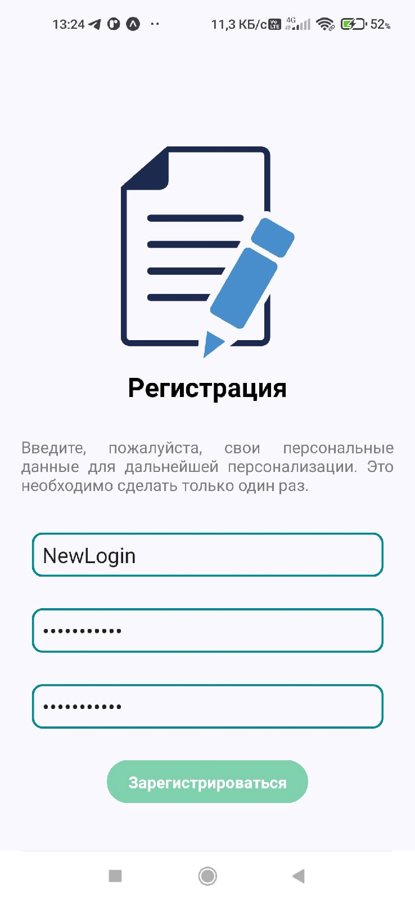
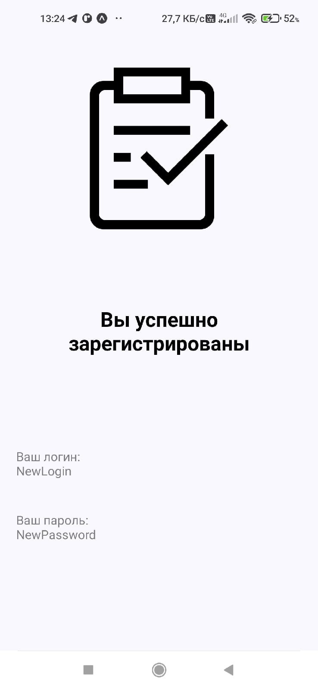
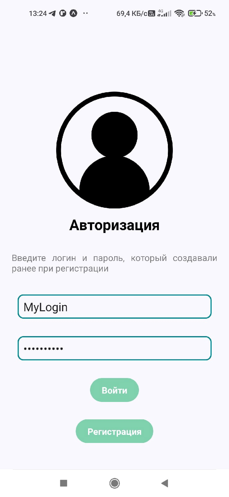
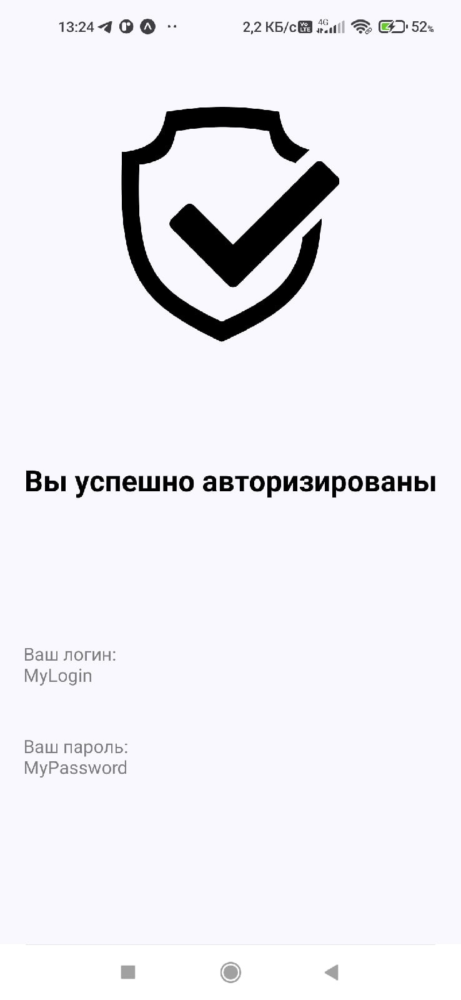

# Передача данных с формы

## Задания для выполнения

1. Изучите реализованный пример: https://snack.expo.dev/49WY2dQMS.

2. Ознакомьтесь с описанием компонента ImageBackground
   https://docs.expo.dev/ui-programming/image-background/

3. Используя реализованную навигацию для велком-скрина с регистрацией (лабораторная 7), создайте экран с приветствием, данные на который будут поступать с соседнего экрана.

4. Поделитесь ссылкой на проект в Expo. Загрузить созданное приложение на на GitHub в репозиторий Student, используя формат в названии Фамилия (латинскими буквами)\_8.

## Выполнение задания:

