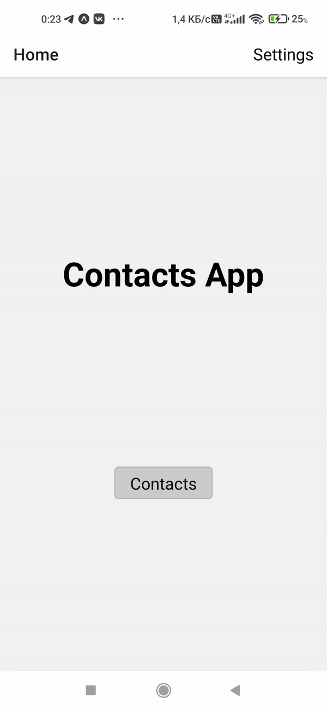

# Навигация в React Native

## Задания для выполнения

1. Используя официальную документацию https://reactnative.dev/docs/navigation создайте три экрана вместе с навигайцией по ним:

2. Добавьте основные компоненты на экраны и создайте книгу контактов, галерею или любое другое простое приложение.

## Выполнение задания

