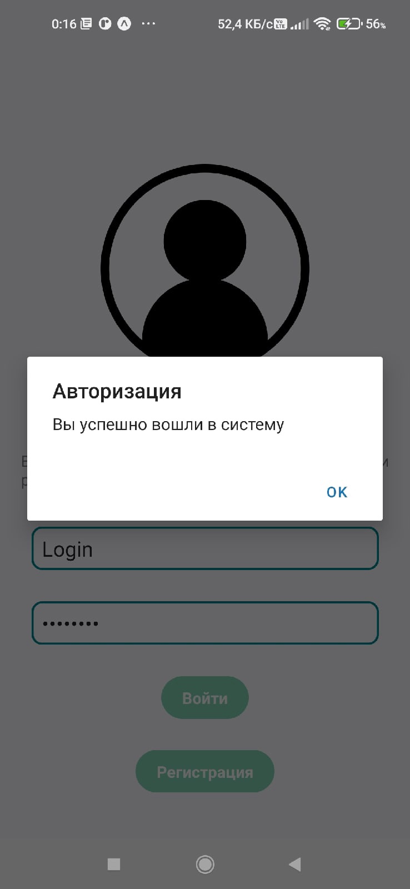
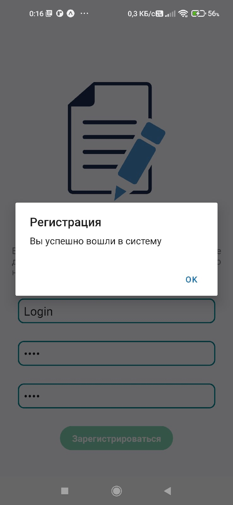

# Форма регистрации

## Задания для выполнения

1. Создайте форму регистрации с экраном альтернативной авторизации в React Native.

2. Добавьте всплывающее сообщение для кнопок: «Регистрация/Авторизация прошла успешна».

3. Поделитесь ссылкой на проект в Expo. Загрузить созданное приложение на на GitHub в репозиторий Student, используя формат в названии Фамилия (латинскими буквами)\_6.

## Выполнение задания:

